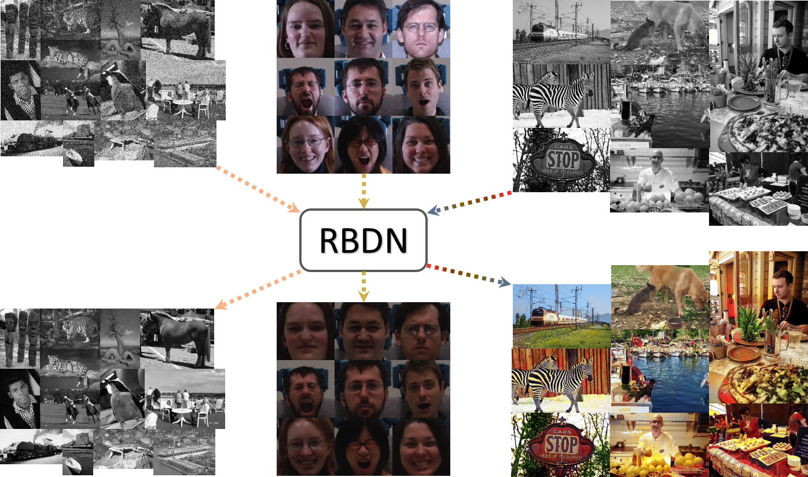
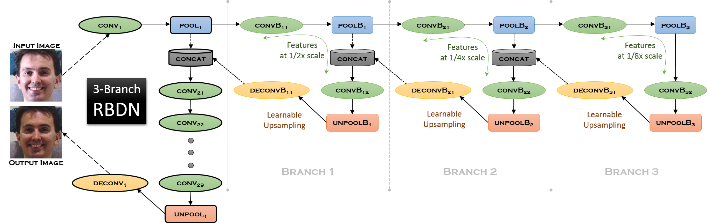
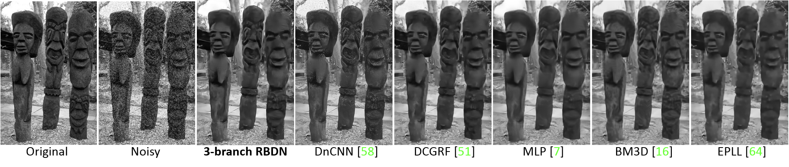
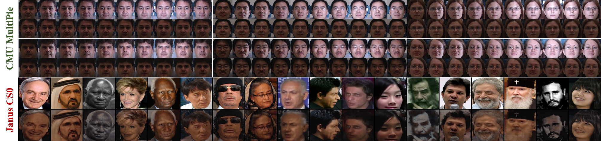
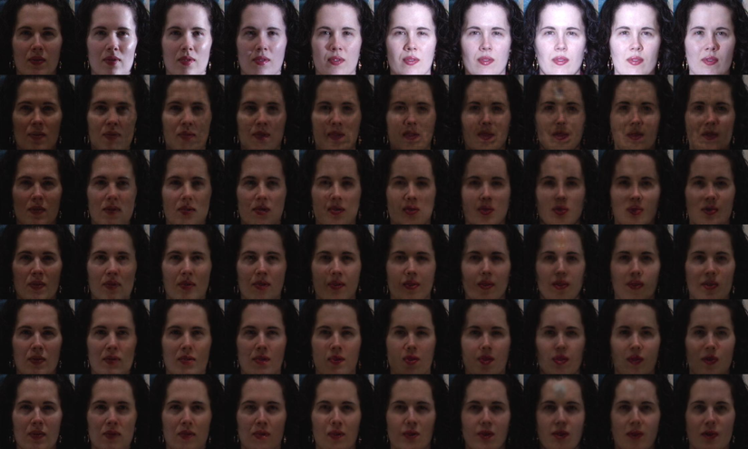
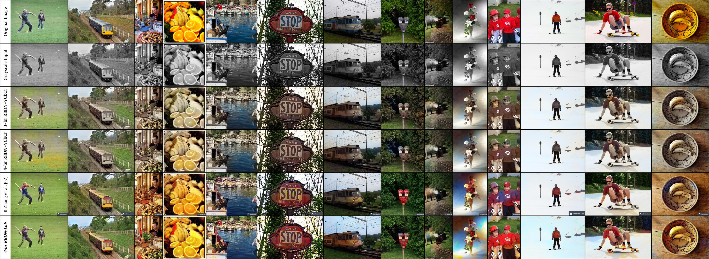

**RBDN** is an architecture for [**Generalized Deep Image to Image Regression**](https://arxiv.org/abs/1612.03268) which features 
* a memory-efficient recursive branched scheme with extensive parameter sharing that computes an early learnable multi-context representation of the input, 
* end-to-end preservation of local correspondences from input to output and 
* ability to choose context-vs-locality based on task as well as apply a per-pixel multi-context non-linearity.  

The core design principle behind the **RBDN** has been an analysis of the strengths and weaknesses of a wide range of diverse creative architectures followed by an incremental modular construction with thorough empirical testing for each design decision.

# Contents

* [**Architecture**](#architecture): Brief description of the **RBDN** architecture.
* [**Experimental Results**](#results)
  * [**Denoising**](#denoising)
  * [**Relighting**](#relighting)
  * [**Colorization**](#colorization)
* [**Installation & Usage**](#usage): Follow these guidelines to set up the **RBDN** code for reproducing all the results shown in this site and the [**paper**](https://arxiv.org/abs/1612.03268).
* [**License & Citation**](#cite)
* [**Acknowledgments**](#ack)

# <a name="architecture"></a>Architecture



:point_up_2: Architecture of proposed generic **RBDN** approach with 3 branches. The various branches extract features at multiple scales. Learnable upsampling with efficient parameter sharing is used to recursively upsample the activations for each branch until it merges with the `POOL1` output, leading to a cheap multi-context representation of the input. This multi-context map is subjected to series of 9 convolutions which can supply ample non-linearity and automatically choose how much context is needed based on the task at hand.

# <a name="results"></a>Experimental Results
**RBDN** gives state-of-the-art performance on 3 diverse *image-to-image regression* tasks: **Denoising**, **Relighting**, **Colorization**.

## <a name="denoising"></a>Denoising
A single **3-branch RBDN** model trained over a wide range of noise levels outperforms previously proposed noise-specific state-of-the-art models at every noise level. 


:point_up_2: Visual comparison of various denoising approaches on a test image from [**BSD300**](https://www2.eecs.berkeley.edu/Research/Projects/CS/vision/bsds/) with White Gaussian Noise of with `st_dev=50`.


:point_up_2: Illustrating the capability of a single **RBDN** model to handle a range of noise levels <span style="color:#B8860B">(yellow box)</span>. **Top Row:** <span style="color:red">Noisy test image</span>. **Bottom Row:** <span style="color:green">Denoised **3-branch RBDN** result</span>


:point_up_2: Illustrating **RBDN**'s ability to reliably denoise at `st_dev=55`, outside our training bounds `(st_dev in [8,50])`. The [**18-layer DnCNN**](https://arxiv.org/abs/1608.03981) (despite using `st_dev=55` for training) is outperformed by our **9-layer RBDN**. <span style="color:red">Red</span>, <span style="color:#B8860B">Yellow</span>, <span style="color:green">Green</span> boxes show the PSNR.

## <a name="relighting"></a>Relighting


:point_up_2: The goal is to render faces from various unknown lighting conditions to a fixed lighting condition. **Odd rows:** Inputs, **Even Rows:** **3-branch RBDN** output. Note that the model is trained exclusively on *frontal* face images with *constrained* illumination variations from [**CMU-MultiPie**](http://www.cs.cmu.edu/afs/cs/project/PIE/MultiPie/Multi-Pie/Home.html), but still generalizes reasonably well to *unconstrained* face images in [**Janus-CS0**](https://www.iarpa.gov/index.php/research-programs/janus) under a variety of *poses, illuminations, expressions, occlusions, affordances* (hats, glasses, *etc.*)


:point_up_2: Analyzing **RBDN** with different branches for relighting a subject from the [**CMU-MultiPie**](http://www.cs.cmu.edu/afs/cs/project/PIE/MultiPie/Multi-Pie/Home.html) validation set. **Top Row:** Input images (ground truth is top-left image). **Second row:** No branches (strong artifacts can be seen). **Third-Sixth row:** **RBDN** outputs for **1,2,3,4** branches respectively. Results improve with increase in number of branches up to **3** branches. The network starts overfitting at **4** branches.

## <a name="colorization"></a>Colorization

We first transform a color image into `YCbCr` color space and predict the chroma `Cb,Cr` channels from the luminance `Y-channel` input using **RBDN**. The input `Y-channel` is then combined with the predicted `Cb,Cr` channels and converted back to `RGB` to yield the predicted color image. We denote this model as **RBDN-YCbCr**. 

Inspired by the recently proposed [**Colorful Colorizations**](http://richzhang.github.io/colorization/) approach, we train another **RBDN** model which takes as input the `L-channel` of a color image in `Lab` space and tries to predict a 313-dimensional vector of probabilities for each pixel (corresponding to 313 `ab` pairs resulting from quantizing the `ab-space` with a grid-size of 10). Subsequently, the problem is treated as multinomial classification and we use a softmax-cross-entropy loss with class re-balancing. During inference, we use the annealed-mean of the softmax distribution to obtain the predicted `ab` channels. We denote this model as **RBDN-Lab**.


:point_up_2: Colorization results for images from [**MS-COCO**](http://mscoco.org/) test set. The **3,4-branch RBDN-YCbCr** models produce decent colorizations, but are very dull and highly under-saturated. The colorizations of **RBDN-Lab** have a higher saturation and appear more colorful for all images.


:point_up_2: Colorizing legacy black-and-white photos: comparing **4-branch RBDN-Lab** with the [**Colorful Colorizations**](http://richzhang.github.io/colorization/) model

# <a name="usage"></a>Installation & Usage

- **Clone:** Run `git clone -b master --single-branch  https://github.com/venkai/RBDN.git`

- **Setup:** Go to repository `cd RBDN` and run `./setup.sh`. This will fetch caffe, download pretrained caffe models for all 3 experiments (**denoising/relighting/colorization**) and inference data, as well as set up the directory structure and symbolic links for all the training/inference scripts.

- **Install Caffe:** Note that `setup.sh` pulls 2 different branches of caffe into 2 separate directories: namely `caffe_colorization` used for **colorization** and `caffe_rbdn` which is used for both **denoising/relighting** experiments. Both these branches will eventually be merged with the master branch in [**venkai/caffe**](https://github.com/venkai/caffe). However for now, you would have to separately install both these caffe versions if you want to perform all 3 experiments.

- **Data:** 

  - Inference data is automatically downloaded by `setup.sh`.
  
  - Training data/imglist for **relighting** experiment can be downloaded from either of these mirrors: [**[1]**](https://drive.google.com/file/d/0B3PoH3B39H2reWxzd3VDZDFVSlE/view?usp=sharing)/[**[2]**](https://drive.google.com/file/d/0B4c0dYlyY36JY3EwWUo3Y2MtNm8/view?usp=sharing)  
  This downloads the file `multipie.tar.gz`. Move it to `./data/training` and run `tar xvzf multipie.tar.gz && rm multipie.tar.gz`

  - **Denoising/colorization** experiments use the same training data/imglist: which is every single *unresized* train & validation image from both [**ImageNet ILSVRC2012**](https://arxiv.org/abs/1409.0575) and [**MS-COCO2014**](http://mscoco.org/) whose smallest spatial dimension is greater than **128** (**~1.7 million** images in total). You can simply download these datasets from their respective sources and place/symlink them within `./data/training/` without any preprocessing whatsoever. Place the appropriate imglist in `./data/training/imgset/train.txt` with the image-paths in `train.txt` being relative to `./data/training` 

  - Note that data folders are not tracked by git.

- **Inference:** Each experiment (**denoising/relighting/colorization**) has its own folder in `./inference` that contains an experiment specific MATLAB inference script `get_pred.m` which uses the [**Matcaffe**](http://caffe.berkeleyvision.org/tutorial/interfaces.html#matlab) interface to evaluate pretrained models in `./models`. The script `./inference/run_matcaffe.sh` can be used to load caffe dependencies to `LD_LIBRARY_PATH` and then start MATLAB interactively.

- **Training:** Each experiment (**denoising/relighting/colorization**) has its own folder in `./training` that contain 2 key experiment specific scripts:
  - `start_train.sh`: This starts training an **RBDN** model, either from scratch or from the most recent snapshot in the `snapshot` directory. You can pause training at any moment with `Ctrl+C` and most recent snapshot will be saved in `./snapshot/trn_iter_[*].solverstate`. Running `./start_train.sh` again will automatically resume from that snapshot. 
  - `run_bn.sh`: This takes the most recent snapshot in `./snapshot` and prepares it for inference by passing training data through the network and computing global mean/variance for all the *batch-normalization* layers in the network. The resulting inference-ready model is saved as `./tst_[ITER].caffemodel`, where `ITER` is the iteration corresponding to the most recent snapshot.

# <a name="cite"></a>License & Citation
**RBDN** is released under a variant of the [BSD 2-Clause license](https://github.com/venkai/RBDN/blob/master/LICENSE). 

If you find **RBDN** useful in your research, please consider citing our paper:

```
@article{santhanam2016generalized,
  title={Generalized Deep Image to Image Regression},
  author={Santhanam, Venkataraman and Morariu, Vlad I and Davis, Larry S},
  journal={arXiv preprint arXiv:1612.03268},
  year={2016}
}
```
  
# <a name="ack"></a>Acknowledgments
* We would like to thank [Yangqing Jia](http://daggerfs.com/), [Evan Shelhamer](http://imaginarynumber.net/) and the [**BVLC/BAIR**](http://bair.berkeley.edu/) team for creating & maintaining [**caffe**](http://caffe.berkeleyvision.org/), [Richard Zhang](https://richzhang.github.io/) for [colorization layers in caffe](https://github.com/richzhang/colorization) and [Hyeonwoo Noh](http://cvlab.postech.ac.kr/~hyeonwoonoh/), [Seunghoon Hong](http://cvlab.postech.ac.kr/~maga33/), [Dmytro Mishkin](https://github.com/ducha-aiki) for several useful caffe layers, all of which were instrumental in creating **RBDN**. 

* This research is based upon work supported by the Office of the Director of National Intelligence (ODNI), Intelligence Advanced Research Projects Activity (IARPA), via IARPA R&D Contract No. 2014-14071600012. The views and conclusions contained herein are those of the authors and should not be interpreted as necessarily representing the official policies or endorsements, either expressed or implied, of the ODNI, IARPA, or the U.S. Government. The U.S. Government is authorized to reproduce and distribute reprints for Governmental purposes notwithstanding any copyright annotation thereon.